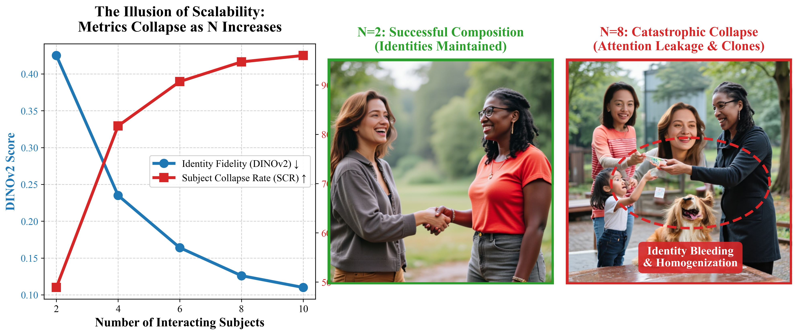
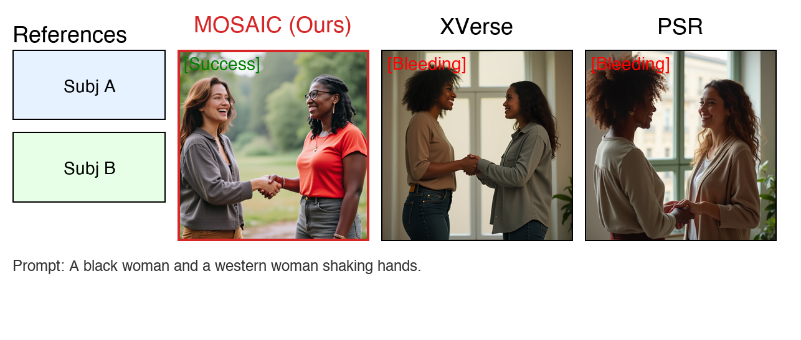

# When Identities Collapse: A Stress-Test Benchmark for Multi-Subject Personalization



This repository contains the code, data, and evaluation scripts for our paper: **"When Identities Collapse: A Stress-Test Benchmark for Multi-Subject Personalization"** (Submitted to CVPR 2026 P13N Workshop).

## 📢 Overview

Subject-driven text-to-image diffusion models have achieved remarkable success in preserving single identities. However, their ability to compose multiple interacting subjects remains highly challenging. When faced with multiple identities, current models often suffer from **Catastrophic Identity Collapse**—features bleed across subjects, or the model generates multiple clones of a single dominant identity.

This repository provides a comprehensive **stress-test benchmark** and a novel evaluation metric (**Subject Collapse Rate - SCR**) to rigorously quantify the limits of state-of-the-art multi-subject models (MOSAIC, XVerse, PSR) as the number of interacting identities scales from 2 to 10.

### Key Contributions
1. **A Scalable Multi-Subject Benchmark**: A rigorous testing suite scaling from 2 to 10 subjects, categorized by interaction complexity (Neutral, Occlusion, Interaction).
2. **Subject Collapse Rate (SCR)**: A new DINOv2-based metric that explicitly quantifies the percentage of subjects that lose their identity in a generated scene, overcoming the "Semantic Shortcut" flaw of global CLIP metrics.
3. **Comprehensive Failure Analysis**: Quantitative and qualitative evidence revealing that while current models succeed at $N=2$, they suffer $>95\%$ identity collapse at $N=8$.

---

## 📊 Benchmark Design

Our benchmark is constructed by sampling from a unified subject pool and inserting them into carefully crafted prompts across five difficulty levels (2, 4, 6, 8, 10 subjects) and three scene types:

*   **Neutral (No Interaction)**: Subjects are spatially separated.
*   **Occlusion**: Subjects partially block one another, testing amodal completion.
*   **Interaction**: Subjects are physically engaged (e.g., hugging, shaking hands), testing severe attention entanglement.


---

## 📈 Evaluation Metrics & SCR

Standard CLIP-T metrics often present an *illusion of scalability*. As $N$ increases, models default to generating a generic "group of people," which satisfies the global text prompt but completely destroys local identity fidelity. 

To address this, we propose **SCR (Subject Collapse Rate)**:
$$ \text{SCR}_{@\tau} = \frac{\sum_{i=1}^{N} \mathbf{1}[\cos(\text{DINOv2}(I_{gen}), \text{DINOv2}(I_{ref}^i)) < \tau]}{N} $$

*See `scripts/` for the evaluation code used to compute DINOv2, CLIP-I, CLIP-T, and SCR.*

---

## 🚀 Repository Structure

```text
├── Paper/
│   ├── images/               # High-res generated charts, grids, and teasers
│   ├── latex_source/         # Full LaTeX source code for the CVPR submission
│   └── section_*.md          # Markdown versions of the paper sections
├── eval_outputs/             # Raw JSON/CSV evaluation metrics for MOSAIC, XVerse, PSR
├── results/                  # Generated images from the benchmarked models
└── scripts/                  # Python scripts for data processing and chart generation
    ├── generate_advanced_teaser.py
    ├── generate_mosaic_style_grid.py
    ├── generate_radar_plot.py
    └── ...
```

---

## 💻 Visualizations and Results

You can find all our generated analytical charts in `Paper/images/`:

1.  **Quantitative Collapse**: `fig1_metrics_vs_subject_count.pdf` demonstrates the sharp decline in DINOv2 and the rise of SCR as subject counts increase.
2.  **Scene Complexity**: `fig2_metrics_vs_scene_type.pdf` compares model performance across Neutral, Occlusion, and Interaction scenarios.
3.  **Case Analysis**: `fig_case_analysis.png` provides a detailed look at Identity Bleeding during physical interaction.



---

## 📝 Citation

If you find our benchmark or metrics useful, please consider citing our work (details pending acceptance).

```bibtex
@article{anonymous2026identities,
  title={When Identities Collapse: A Stress-Test Benchmark for Multi-Subject Personalization},
  author={Anonymous},
  journal={CVPR P13N Workshop},
  year={2026}
}
```
